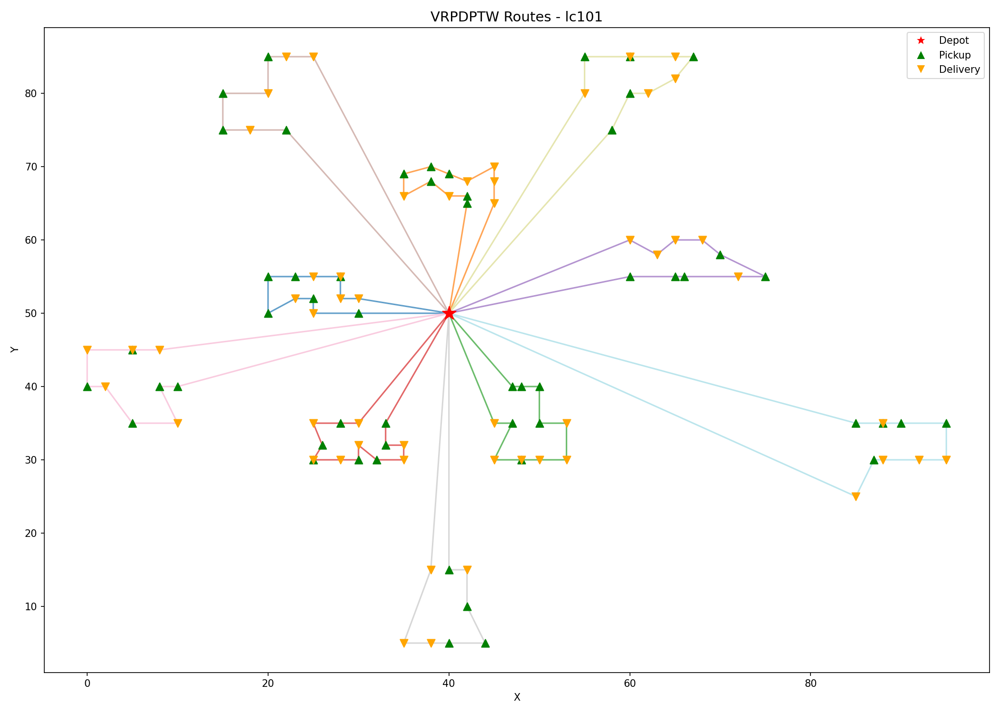

# VRPDPTW Solver - lc101

## Problem Description

Vehicle Routing Problem with Pickup, Delivery and Time Windows (VRPDPTW):

Route multiple vehicles from a depot to handle a set of transportation requests. Each request consists of a pickup location and a delivery location. The objective is to minimize total travel distance while satisfying:

- **Pairing**: each pickup and its delivery must be served by the same vehicle
- **Precedence**: pickup must be visited before its paired delivery
- **Time windows**: every node must be visited within its time window [earliest, latest]
- **Capacity**: vehicle load must not exceed capacity at any point

## Dataset

Li & Lim Benchmark lc101 — https://www.sintef.no/projectweb/top/pdptw/

- Nodes: 106 (53 pickup-delivery pairs)
- Vehicles: 25 available, capacity 200 each

## Method

Solved using Google OR-Tools:

1. Parse lc101.txt (Li & Lim format)
2. Compute Euclidean distance matrix
3. Build model with capacity, time window, and pickup-delivery constraints
4. Initial solution: PARALLEL_CHEAPEST_INSERTION + improvement: GUIDED_LOCAL_SEARCH

## Requirements

```
pip install ortools matplotlib numpy
```

## Usage

Run all cells in order in Jupyter Notebook.  
Make sure `lc101.txt` and `VRPDPTW.ipynb` are in the same directory.

## Results

- Vehicles used: 10
- Total distance: 809 (integer precision)



## Comparison with Best Known Solution (Li & Lim 2001)

The distance gap is due to integer truncation in the distance matrix. All 10 routes match the best known solution exactly:

| Route | This Project | Best Known |
|---|---|---|
| 1 | 5→3→7→8→10→11→9→6→4→2→1→75 | 5 3 7 8 10 11 9 6 4 2 1 75 |
| 2 | 20→24→25→27→29→30→28→26→23→103→22→21 | 20 24 25 27 29 30 28 26 23 103 22 21 |
| 3 | 67→65→63→62→74→72→61→64→102→68→66→69 | 67 65 63 62 74 72 61 64 102 68 66 69 |
| 4 | 43→42→41→40→44→46→45→48→51→101→50→52→49→47 | 43 42 41 40 44 46 45 48 51 101 50 52 49 47 |
| 5 | 90→87→86→83→82→84→85→88→89→91 | 90 87 86 83 82 84 85 88 89 91 |
| 6 | 13→17→18→19→15→16→14→12 | 13 17 18 19 15 16 14 12 |
| 7 | 32→33→31→35→37→38→39→36→105→34 | 32 33 31 35 37 38 39 36 105 34 |
| 8 | 57→55→54→53→56→58→60→59 | 57 55 54 53 56 58 60 59 |
| 9 | 98→96→95→94→92→93→97→106→100→99 | 98 96 95 94 92 93 97 106 100 99 |
| 10 | 81→78→104→76→71→70→73→77→79→80 | 81 78 104 76 71 70 73 77 79 80 |

## Compared to VRPTW

1. **Different data format**: Solomon benchmark requires scanning for keywords (`NUMBER`, `CUST NO.`) to locate data. Li & Lim is simpler — the first line is parsed directly and every subsequent line follows a fixed column structure, with two additional columns for pickup/delivery pairing.

2. **Nodes have types**: In VRPTW all customer nodes are equivalent. In VRPDPTW, nodes are either pickup (positive demand) or delivery (negative demand). OR-Tools accumulates demand along the route, so the sign difference correctly models loading and unloading.

3. **PD constraint depends on time dimension**: The precedence constraint (`CumulVar(pickup) <= CumulVar(delivery)`) requires the time dimension to already exist. This means `add_time_window_constraint` must explicitly return `time_dimension` so the PD function can use it — unlike in VRPTW where the time window function had no return value.
